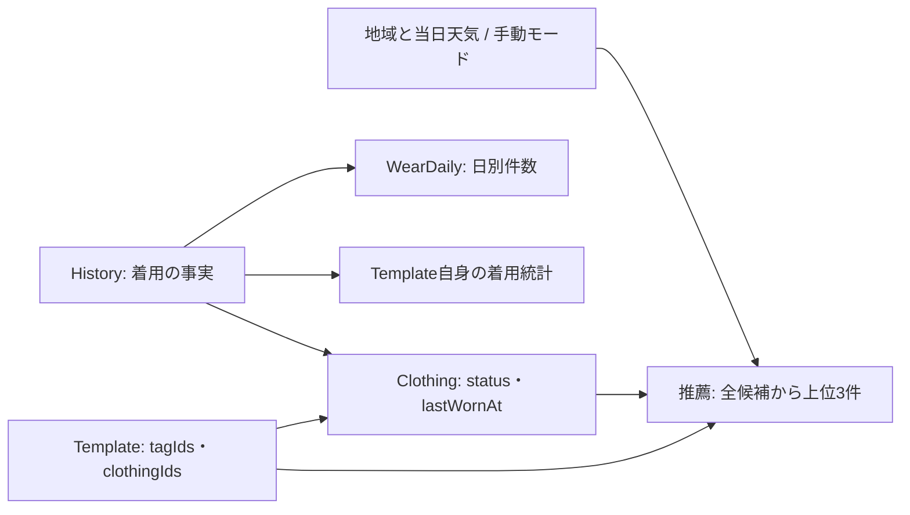

# 天気連動テンプレート推薦のデータモデルとアクセスパターン調査

調査日: 2026-10-08。対象は [実装マップ #271](https://github.com/Kurarowa305/wardrobe/issues/271) 全体。製品仕様の正本は [#272 の確定仕様](https://github.com/Kurarowa305/wardrobe/issues/272#issuecomment-6049332495)。本資料は [取得方式・整合性の判断 #275](https://github.com/Kurarowa305/wardrobe/issues/275) を進めるための調査であり、実装・本番監査・データ補正を行った記録ではない。

## 調査後の判断更新

本資料の「未決」「質問中」は調査時点の状態を示す。その後、ユーザーがQ5・Q6の自動再試行を不要とし、Q7のキャッシュ無効化範囲を承認した。再試行を除いた提示案を維持し、最新の合意・未決事項は[取得整合性判断](天気連動テンプレート推薦_取得整合性判断.md)を正本とする。さらにQ8のベーステーブル強整合Query＋強整合BatchGet、Q9の追加検証・修正範囲の引き継ぎも承認済み。以下は判断に至った調査記録として残す。

## 結論

既存の服・テンプレート・履歴・日別カウンタを利用して推薦を計算できる。推薦のための新しい永続集計や GSI は、現時点の合意では追加しない。永続データへの機能上の追加はワードローブの地域設定。天気の同日再利用にはキャッシュが必要だが、保存先・キー形式・TTL はまだ決まっていない。モードと推薦結果は、ワードローブへ保存するデータではない。[仕様](https://github.com/Kurarowa305/wardrobe/issues/272#issuecomment-6049332495)、[合意済み ADR](../../docs/adr/0001-template-recommendation-read-model.md)、[天気の判断 #274](https://github.com/Kurarowa305/wardrobe/issues/274)

一方、読み取り処理の単純な再利用では整合性の合意を満たさない。既存テンプレート一覧は GSI、構成服一括取得は強い整合性のベーステーブル読み取りである。GSI は結果整合性のみなので、「取得開始前に完了した更新を反映する」ための推薦専用の取得経路が必要になる。さらに順位の根拠である `Clothing.lastWornAt` 自体が派生統計なので、履歴作成・削除の整合性修正も前提になる。[templateRepo](../../apps/api/src/domains/template/repo/templateRepo.ts)、[clothingBatchGetRepo](../../apps/api/src/domains/clothing/repo/clothingBatchGetRepo.ts)、[AWS 読み取り整合性](https://docs.aws.amazon.com/amazondynamodb/latest/developerguide/HowItWorks.ReadConsistency.html)、[取得整合性判断](天気連動テンプレート推薦_取得整合性判断.md)

## 状態の読み分け

- **現行実装**: リポジトリに存在する振る舞い。設計資料と差がある箇所はコードを優先する。
- **確定仕様**: #272 の正本で合意済みの製品要件。
- **合意済み判断**: Q1〜Q4。順位は `max(構成服.lastWornAt)`、同点は `Template.createdAt` 昇順、さらに `templateId` 昇順。全候補を再読取し、推薦専用集計は作らない。取得前に完了した更新を反映し、途中の並行更新は次回取得で反映。後続で同日履歴削除の修正・回帰テスト・既存データの読み取り監査、不一致時の補正計画を扱う。[判断資料](天気連動テンプレート推薦_取得整合性判断.md)
- **未決**: Q5 の真の欠落・一時的未取得への応答、Q6 の並列数・再試行・時間上限、Q7 の無効化範囲。4並列、追加2回、DB全体5秒は質問中の案であって決定値ではない。地域・天気・推薦の API 契約と状態寿命も [#276](https://github.com/Kurarowa305/wardrobe/issues/276) で未決。
- **調査からの提案**: 以下のベーステーブル Query や属性案。実装方針として承認されたものとは扱わない。

## 1. 関連する既存データモデル

### 1.1 ベーステーブルと属性

単一 DynamoDB テーブルの主キーは `(PK, SK)`。以下の `w/c/t/h/d` はそれぞれ wardrobeId/clothingId/templateId/historyId/yyyymmdd を表す。[DB 設計](../DB設計.md)、[Terraform](../../infra/terraform/app/dynamodb.tf)

| データ | PK / SK | 関連する現行属性・役割 | 一次資料 |
|---|---|---|---|
| Wardrobe | `W#w` / `META` | `wardrobeId, name, createdAt`。地域属性はまだない | [wardrobeRepo](../../apps/api/src/domains/wardrobe/repo/wardrobeRepo.ts) |
| Clothing | `W#w#CLOTH` / `CLOTH#c` | `wardrobeId, clothingId, name, genre, imageKey, tagIds, status, deletedAt, createdAt, wearCount, lastWornAt`。未着用は0 | [entity](../../apps/api/src/domains/clothing/entities/clothing.ts)、[keys](../../apps/api/src/domains/clothing/repo/clothingKeys.ts) |
| Template | `W#w#TPL` / `TPL#t` | `wardrobeId, templateId, name, clothingIds, tagIds, status, deletedAt, createdAt, wearCount, lastWornAt`。構成服は順序付き1〜20件 | [entity](../../apps/api/src/domains/template/entities/template.ts)、[schema](../../apps/api/src/domains/template/schema/templateSchema.ts)、[keys](../../apps/api/src/domains/template/repo/templateKeys.ts) |
| History | `W#w#HIST` / `HIST#h` | `wardrobeId, historyId, date, templateId, clothingIds, createdAt`。テンプレート記録時には作成時点の構成服IDを複写する。服の組合せ記録は templateId=null | [entity](../../apps/api/src/domains/history/entities/history.ts)、[create usecase](../../apps/api/src/domains/history/usecases/createHistoryWithStatsWrite.ts)、[keys](../../apps/api/src/domains/history/repo/historyKeys.ts) |
| ClothingWearDaily | `W#w#COUNT#CLOTH#c` / `DATE#d` | 服ごとの日別着用件数 `count`。同日複数記録を保持 | [keys](../../apps/api/src/domains/history/stats_write/keys.ts)、[write builder](../../apps/api/src/domains/history/stats_write/transact/buildItems.ts) |
| TemplateWearDaily | `W#w#COUNT#TPL#t` / `DATE#d` | そのテンプレートを指定して記録した日別件数 `count` | [daily aggregation](../../apps/api/src/domains/history/stats_write/aggregations/daily.ts)、[write builder](../../apps/api/src/domains/history/stats_write/transact/buildItems.ts) |

服・テンプレートは `ACTIVE/DELETED` による論理削除。履歴は削除トランザクションで物理削除される。日別カウンタも最後の1件を削除する場合はアイテムを削除する。[clothingRepo](../../apps/api/src/domains/clothing/repo/clothingRepo.ts)、[templateRepo](../../apps/api/src/domains/template/repo/templateRepo.ts)、[delete history](../../apps/api/src/domains/history/usecases/deleteHistoryWithStatsWrite.ts)

日別カウンタは設計資料に `date` 属性の記載があるが、現行トランザクションが書くのはキーと `count`。再計算は `SK=DATE#d` から日付を復元する。週・月の集計を本推薦が読む実装はなく、現行 plan は `daily` のみ。[DB 設計](../DB設計.md)、[write builder](../../apps/api/src/domains/history/stats_write/transact/buildItems.ts)、[wearDailyQueryRepo](../../apps/api/src/domains/history/stats_write/repo/wearDailyQueryRepo.ts)、[plan](../../apps/api/src/domains/history/stats_write/plan.ts)

### 1.2 正本と派生値

着用の事実は History、その日別集計が WearDaily、その集計を服・テンプレートの `wearCount/lastWornAt` に反映する。`createdAt` は登録時刻、`History.date` は着用日なので混同しない。現在の lastWornAt は `date` を **UTC 0時の Unix ms** に変換した日付値であり、実際に保存ボタンを押した時刻ではない。新ホームでは記録する日付を **JST の今日** とするが、既存統計の数値表現変更までは仕様で要求されていない。[daily aggregation](../../apps/api/src/domains/history/stats_write/aggregations/daily.ts)、[記録仕様 #283](https://github.com/Kurarowa305/wardrobe/issues/283)

`Template.lastWornAt` はそのテンプレートを指定した履歴により更新される。構成服を別テンプレートや組合せで着たことは、服側の値へ反映される。従って既存 `Template.lastWornAt` は新しい推薦順位とは別物。新順位 `max(構成服.lastWornAt)` は取得時の計算値であり、既存属性をその意味に変更してはならない。[daily aggregation](../../apps/api/src/domains/history/stats_write/aggregations/daily.ts)、[仕様](https://github.com/Kurarowa305/wardrobe/issues/272#issuecomment-6049332495)

タグは別テーブルではなく服・テンプレートの配列。固定値は `season:spring/summer/autumn/winter/all`。旧データの欠損や未知値は normalize 時に除去され、未設定は空配列として扱う。新推薦の季節条件は Template.tagIds のみで判定する。[itemTagSchema](../../apps/api/src/domains/tags/itemTagSchema.ts)、[タグ ADR](../ADR_服テンプレートタグ設計方針.md)、[仕様](https://github.com/Kurarowa305/wardrobe/issues/272#issuecomment-6049332495)

### 1.3 現行 GSI

全 GSI の Projection は `ALL`。`statusListPk` は `W#w#CLOTH#status` または `W#w#TPL#status`。以下のキーは推薦スコアの索引ではない。[Terraform](../../infra/terraform/app/dynamodb.tf)、[服 keys](../../apps/api/src/domains/clothing/repo/clothingKeys.ts)、[テンプレート keys](../../apps/api/src/domains/template/repo/templateKeys.ts)

| GSI | Hash / Range 属性 | 値と用途 |
|---|---|---|
| StatusListByCreatedAt | statusListPk / createdAtSk | `CREATED#<createdAt>#<id>`、登録順 |
| StatusGenreListByCreatedAt | statusGenreListPk / createdAtSk | `W#w#CLOTH#status#GENRE#genre`、服のジャンル別一覧 |
| StatusListByWearCount | statusListPk / wearCountSk | `WEAR#<10桁ゼロ埋め回数>#<id>`、対象自身の回数順 |
| StatusListByLastWornAt | statusListPk / lastWornAtSk | `LASTWORN#<lastWornAt>#<id>`、対象自身の着用日順 |
| HistoryByDate | PK / historyDateSk | `W#w#HIST` / `DATE#d#h`、履歴の日付範囲・順序 |

新推薦で StatusListByLastWornAt のテンプレート先頭3件を読む方法は順位の意味が異なる。服側の先頭数件からテンプレートを逆引きする索引もない。既存一覧 API のDTOは表示用で、推薦に必要な全属性をそのまま提供する契約ではないため、サーバー内 repository から候補を読む経路を追加する必要がある。[templateRepo](../../apps/api/src/domains/template/repo/templateRepo.ts)、[template schema](../../apps/api/src/domains/template/schema/templateSchema.ts)、[合意 ADR](../../docs/adr/0001-template-recommendation-read-model.md)

図の矢印は参照・計算依存を表す。履歴・日別件数・本体統計は履歴書込トランザクションで更新され、推薦はそれらとは別に取得時に計算する。[write builder](../../apps/api/src/domains/history/stats_write/transact/buildItems.ts)、[合意 ADR](../../docs/adr/0001-template-recommendation-read-model.md)

## 2. 本改修のデータモデル差分

| 対象 | 改修前 → 改修後 | 保存責務・確定範囲 | 担当判断／実装 |
|---|---|---|---|
| 地域設定 | なし → ワードローブ共有の任意地域 | **確定**: 既存は未設定、新規作成の必須にしない。**未決**: QWeather地点ID・表示名・座標等のどれを保存し、どう検証するか。METAへの任意属性追加は自然な案だが物理schema未決 | [#276](https://github.com/Kurarowa305/wardrobe/issues/276) / [#279](https://github.com/Kurarowa305/wardrobe/issues/279) |
| 日次天気 | なし → 地域・対象日の天気、最高最低気温、任意の服装指数 | **確定**: QWeather第一候補、天気と指数は同一サービス。当日取得済み情報へfallback。**未決**: 保存先、地域×日付の具体キー、取得日時/更新日時、TTL、再取得間隔。新DynamoDB item/table/GSIを確定事項として追加しない | [#274](https://github.com/Kurarowa305/wardrobe/issues/274) / [#280](https://github.com/Kurarowa305/wardrobe/issues/280) |
| 選択モード | なし → 自動・春・夏・秋・冬 | **確定**: アプリ内メモリ状態とリクエスト入力。永続化・端末共有しない。起動時と日付変更時は自動。**未決**: 画面往復、背景復帰時の寿命 | [仕様](https://github.com/Kurarowa305/wardrobe/issues/272#issuecomment-6049332495)、[#276](https://github.com/Kurarowa305/wardrobe/issues/276) |
| 内部の対象季節 | 月で服推薦 → 指数優先、最高気温fallback | **確定**: 冬／春秋／夏。手動の春・秋は別。永続マスタの追加を要件にしない。低温・雨風・月の追加判定なし | [仕様](https://github.com/Kurarowa305/wardrobe/issues/272#issuecomment-6049332495)、[#280](https://github.com/Kurarowa305/wardrobe/issues/280) |
| Template / Clothing | 既存タグ・構成・統計 → それらを使う推薦 | **合意**: 新集計属性・逆引き関係・推薦GSIは当初不要。既存lastWornAtの意味は維持。読み取り経路と統計更新の修正が必要 | [ADR](../../docs/adr/0001-template-recommendation-read-model.md)、[#278](https://github.com/Kurarowa305/wardrobe/issues/278)、[#281](https://github.com/Kurarowa305/wardrobe/issues/281) |
| 推薦結果 | 服tops/bottoms各2件 → テンプレート0〜3件 | **合意**: サーバー計算結果。DBへ推薦順位を保存しない。Web query cacheは別概念。**未決**: DTO、天気/推薦エラーの表現、cache key・無効化 | [#276](https://github.com/Kurarowa305/wardrobe/issues/276)、[#281](https://github.com/Kurarowa305/wardrobe/issues/281) |
| 着用記録 | 既存記録画面 → ホーム確認ダイアログからも作成 | **確定**: 既存Historyの概念を再利用、JST今日、同日複数記録許容。**未決**: 結果不明時の再送/冪等性、確認中の編集・日付変更。新履歴テーブルは要件にない | [#276](https://github.com/Kurarowa305/wardrobe/issues/276)、[#283](https://github.com/Kurarowa305/wardrobe/issues/283) |
| ホーム履歴 | 直近取得あり → ホームからの表示・取得を削除 | **確定**: Historyおよび履歴タブは保持。データ削除や履歴索引撤去ではない | [#282](https://github.com/Kurarowa305/wardrobe/issues/282) |

天気キャッシュ、服の着用統計、Web query cache は別のデータである。天気キャッシュの当日fallbackは気象情報の再利用、服統計は履歴の派生値、Web query cacheは画面応答の再利用。それぞれ更新元と失効条件が異なる。[#274](https://github.com/Kurarowa305/wardrobe/issues/274)、[daily aggregation](../../apps/api/src/domains/history/stats_write/aggregations/daily.ts)、[queryKeys](../../apps/web/src/api/queryKeys.ts)

## 3. 本改修のアクセスパターン

### 3.1 画面操作・論理 API

未決の URL や HTTP method はここで新たに確定しない。「地域検索」「天気」「推薦」は論理操作であり、APIを分割するかまとめるかも #276 の判断対象。[#276](https://github.com/Kurarowa305/wardrobe/issues/276)

| 操作 | 主な入力 | 読み取り／書き込みと出力 | 既存からの差分 |
|---|---|---|---|
| ホーム初期表示 | wardrobeId、mode=自動、対象日 | 地域設定 → 当日天気 → 季節条件 → テンプレート推薦。地域なし/予報なしは手動選択の案内 | wardrobe取得再利用＋地域・天気・推薦の追加。旧服推薦・直近履歴取得を除去 |
| 地域検索 | 検索文字列 | 地点候補と選択識別情報を外部サービスから取得。検索段階ではWardrobeを更新しない | 追加。DB検索索引は現時点で不要、検索キャッシュは未決 |
| 地域を設定・変更 | wardrobeId、選択地域 | 妥当性確認、地域の保存、地域・天気・推薦を更新 | Wardrobe更新経路が追加。旧地域応答との競合防止が必要 |
| 天気取得 | 保存地域、対象日 | 有効な予報/指数取得、同日cache fallback、取得状態 | 追加。手動推薦の成功を天気の成功に依存させない |
| モード切替 | wardrobeId、選択mode、対象日等 | 対象季節を変更して候補全体から最大3件再選出 | 新推薦読取。モード切替によるDB書込なし |
| 記録確認 | templateId | 名前・全構成服・記録日を表示。キャンセルは作成なし | 推薦DTOで賄うか詳細GETか未決 |
| 確認後に記録 | wardrobeId、templateId、JST今日 | 現行 `POST /wardrobes/:id/histories` を基本に履歴作成＋統計更新。成功後推薦再取得 | 既存履歴処理再利用、ホーム導線追加、再送契約未決 |
| 履歴削除 | wardrobeId、historyId | 履歴削除＋服/テンプレート統計再計算 | 既存処理の修正が前提。推薦無効化の具体範囲はQ7未決 |
| 服/テンプレート編集・削除 | 対象ID、変更内容 | 既存DB更新。タグ/構成/状態の変更は推薦候補へ影響 | 新DBモデル不要。いつ表示結果を再取得するかQ7/#276未決 |

根拠: [確定仕様](https://github.com/Kurarowa305/wardrobe/issues/272#issuecomment-6049332495)、[#276](https://github.com/Kurarowa305/wardrobe/issues/276)、[現行Home](../../apps/web/src/components/app/screens/HomeTabScreen.tsx)、[History endpoint](../../apps/web/src/api/endpoints/history.ts)、[Wardrobe endpoint](../../apps/web/src/api/endpoints/wardrobe.ts)。現行Wardrobe取得DTOは名前のみで、単にDBへ地域を追加するだけではWebへ届かない。

### 3.2 DynamoDB 読み取り・書き込み

推薦については、合意済み保証を満たす **実装案** としてベーステーブルの強い整合性 Query を示す。これ自体を決定済みとしない。

| 操作 | キーとDynamoDB操作 | 整合性・ページング | 読み書き量の増え方 |
|---|---|---|---|
| 地域を読む | `GetItem W#w / META` を拡張する案 | 現行は `ConsistentRead=true` | 1 wardrobe item。地域検索結果とは別 |
| 地域を保存 | `UpdateItem W#w / META` に任意地域を追加する案 | 不在更新・競合・入力検証は#276。GSI追加を要求しない | 地域変更ごとに1 item更新という案 |
| 天気cache | 地域×対象日という論理キー | 具体的DB/キー/TTL未決。前日cacheを当日扱いしない | 取得地域数×対象日数に依存。保持日数・共有範囲次第 |
| テンプレート全候補を列挙 | **提案**: ベース `Query PK=W#w#TPL`、必要に応じSK prefix `TPL#`。取得後 `ACTIVE` とTemplate.tagIds判定 | `ConsistentRead=true`、LastEvaluatedKeyがなくなるまで全ページ。GSIを使わないので完了済み新規作成の見落としを避ける | ACTIVEだけでなくDELETEDも含む全T件の読取。季節外も読んでから除外 |
| 構成服を取得 | 対象テンプレートの全 clothingIdsを重複排除して `BatchGetItem W#w#CLOTH / CLOTH#c` | 現行は強い整合性、80件単位。全服の完全性と状態を確認、未処理キーを不存在と混同しない | 季節対象のユニーク服U件。サムネイル分だけの取得では足りない |
| 推薦を計算 | DynamoDB書込なし | 全候補が揃ってから score→createdAt→ID の数値/文字列比較。0〜3件。順不同BatchGetはIDで結合 | 全構成関係E件を評価。履歴H件の読取や全テンプレートへの更新連鎖は不要 |
| テンプレート記録の事前読取 | `GetItem W#w#TPL / TPL#t` ＋ 構成服のBatchGet | 両方strong。記録時にテンプレートの現在の構成を取得する既存動作 | 1テンプレート＋m服 |
| 履歴作成 | `TransactWriteItems`: `Put W#w#HIST/HIST#h`、各対象の `COUNT/DATE#d` 更新、各対象の統計と `wearCountSk/lastWornAtSk` 更新 | 一括書込、統計は現行wearCount一致条件を使用 | テンプレート記録は `1+2(m+1)=2m+3` items、服組合せは `1+2m` items。共有服を使う他テンプレートは更新しない |
| 履歴削除の事前読取 | HistoryのGet、服BatchGet、templateIdがあればTemplateのGet、各対象COUNT/DATE#dのGet、必要ならCOUNT partitionで `SK<DATE#d` 降順Limit=1 Query | Get/BatchGetはstrong。現行の過去日QueryはConsistentRead未指定。同日の残件数を見て再計算する修正が必要 | 対象数に比例したGet/Query。履歴全件を読む実装ではない |
| 履歴削除の書込 | 同じキー群にHistory Delete、日別count減算/最後ならDelete、統計・索引値Updateのtransaction | 書込前に計算した値と同時更新との整合性も要確認 | 作成同様 `2m+3` または `2m+1` items |
| 既存データの監査 | **後続計画**: Historyを基に服/テンプレート別件数・最新日を再集計し、COUNT/本体統計と比較 | 現時点では実行しない。稼働中更新を不一致と誤認しない監査条件が必要 | 推薦1回の通常経路に含めない。履歴量Hに比例する別作業 |

一次資料: [wardrobeRepo](../../apps/api/src/domains/wardrobe/repo/wardrobeRepo.ts)、[templateRepo](../../apps/api/src/domains/template/repo/templateRepo.ts)、[clothingBatchGetRepo](../../apps/api/src/domains/clothing/repo/clothingBatchGetRepo.ts)、[create history](../../apps/api/src/domains/history/usecases/createHistoryWithStatsWrite.ts)、[delete history](../../apps/api/src/domains/history/usecases/deleteHistoryWithStatsWrite.ts)、[transaction builder](../../apps/api/src/domains/history/stats_write/transact/buildItems.ts)、[wearDailyQueryRepo](../../apps/api/src/domains/history/stats_write/repo/wearDailyQueryRepo.ts)、[天気判断 #274](https://github.com/Kurarowa305/wardrobe/issues/274)、[合意済み監査範囲](天気連動テンプレート推薦_取得整合性判断.md)

### 3.3 取得量の見積もり方

`T=削除済みを含むテンプレート総数`、`S=ACTIVEかつ季節対象のテンプレート数`、`E=対象テンプレートの構成服参照数の合計`、`U=そのユニーク服数` とする。構成上限から `E≤20S`、`U≤E`。ベースQuery案の読取対象は概ね **T+U件**、一括取得の初回要求は現行80分割なら `ceil(U/80)` 回。ページ数はアイテムサイズやページ上限にも依存し、件数だけではRCUや所要時間を算出できない。例えばT=100、S=40、E=200、共有を除いてU=120なら、テンプレート全ページと服120件、初回BatchGetは2要求。これは登録数の仮定による計算例であり実測値ではない。[schema](../../apps/api/src/domains/template/schema/templateSchema.ts)、[BatchGet実装](../../apps/api/src/domains/clothing/repo/clothingBatchGetRepo.ts)

服80件はこのアプリの分割値であり、AWSサービスの上限ではない。AWSのBatchGetItemは最大100件・16MBで、部分応答のUnprocessedKeys、順不同の返却、同一キー重複時のエラーに対応する必要がある。存在しない項目は返らないが、未処理キーが解消していない段階で「存在しない」と判断できない。[AWS BatchGetItem](https://docs.aws.amazon.com/amazondynamodb/latest/APIReference/API_BatchGetItem.html)

## 4. そのまま再利用できない点と未決事項

### 4.1 GSI と完了済み更新の反映

GSI全ページ→各Templateをstrong Getし直すだけでは、新規作成がGSIに未反映でID自体を発見できない問題が残る。ベースPK Query案なら既存キーで全列挙でき、新索引・移行は必須ではない。ただし現行 `DynamoDbClient.QueryInput` に `ConsistentRead` がないため、wrapperの型と推薦用repositoryの追加が必要。これは本調査の提案であって今回の実装ではない。[templateRepo](../../apps/api/src/domains/template/repo/templateRepo.ts)、[client QueryInput](../../apps/api/src/clients/dynamodb.ts)、[AWS 読み取り整合性](https://docs.aws.amazon.com/amazondynamodb/latest/developerguide/HowItWorks.ReadConsistency.html)

strong読取でも複数Query/BatchGet全体は同一時点のsnapshotではない。これは「取得途中の更新は次回反映」とする合意の限界に対応する。一方、書込済みの `lastWornAt` 自体が誤っていればstrongでも正しい順位にはならない。[AWS transaction isolation](https://docs.aws.amazon.com/amazondynamodb/latest/developerguide/transaction-apis.html)、[ADR](../../docs/adr/0001-template-recommendation-read-model.md)

### 4.2 BatchGet の完全性と期限

現行helperは全chunkを `Promise.all` で同時実行し、未処理キーの再取得を行わない。現行履歴処理もResponsesだけを見て、不足をNOT_FOUND扱いし得る。新推薦には、要求済みID・応答ID・未処理IDを管理し、全構成服のstatus/lastWornAtを確認する経路が必要。真の欠落の応答、最大同時数、再試行回数・待機・全体期限はQ5/Q6の判断として残す。削除済みの除外自体は仕様で確定している。[BatchGet helper](../../apps/api/src/domains/clothing/repo/clothingBatchGetRepo.ts)、[create history](../../apps/api/src/domains/history/usecases/createHistoryWithStatsWrite.ts)、[#281](https://github.com/Kurarowa305/wardrobe/issues/281)

### 4.3 統計更新の既知問題とコード上の追加懸念

同日2件から1件削除しても日別countは1件残る一方、再計算が「削除日より前」だけを探して `lastWornAt=0` になるケースは、先行調査でローカル再現済み。本番影響は未確認。本資料はその再現を新たに実施した記録ではない。現行コードでは次のlastWornAtの計算が日別件数取得より先に行われる。[先行判断資料](天気連動テンプレート推薦_取得整合性判断.md)、[delete history](../../apps/api/src/domains/history/usecases/deleteHistoryWithStatsWrite.ts)、[recompute](../../apps/api/src/domains/history/stats_write/recompute/lastWornAt.ts)

追加で、次を後続実装・検証の入口として確認した。

- 過去日COUNTを読むQueryに `ConsistentRead` がなく、推薦だけをstrongにしても派生値の生成元の読取が保証されない。[wearDailyQueryRepo](../../apps/api/src/domains/history/stats_write/repo/wearDailyQueryRepo.ts)
- schema上はテンプレート20服を許すが、履歴transaction guardは25 items。テンプレート記録は `2m+3` なので12服から27、20服で43となり、現行guardにより拒否される。ホーム記録で再利用する前に上限整合を扱う必要がある。この調査で依存差し替えによる実行でも20服・43itemsのguard拒否を確認した。外部接続はなく、本番発生件数は調べていない。[template schema](../../apps/api/src/domains/template/schema/templateSchema.ts)、[guard](../../apps/api/src/domains/history/stats_write/transact/guard.ts)、[create history](../../apps/api/src/domains/history/usecases/createHistoryWithStatsWrite.ts)
- 服・テンプレートの通常編集は読取時の統計も含めてUpdateし、条件は存在確認のみ。履歴作成と編集が重なると古い統計の書戻しが起こり得る。これは**コード読解上の競合懸念で未再現**。同日削除の再現済み問題と区別する。[clothingRepo](../../apps/api/src/domains/clothing/repo/clothingRepo.ts)、[clothingUsecase](../../apps/api/src/domains/clothing/usecases/clothingUsecase.ts)、[templateRepo](../../apps/api/src/domains/template/repo/templateRepo.ts)、[templateUsecase](../../apps/api/src/domains/template/usecases/templateUsecase.ts)

- 統計transactionの比較条件はwearCount一致であり、versionやlastWornAtの一致ではない。追加と削除で件数が同じに戻る並行更新や日別countの判定との競合は、**未再現の検証論点**。読み取りをstrongにするだけで書込処理全体の整合性を保証したとは言えない。[write builder](../../apps/api/src/domains/history/stats_write/transact/buildItems.ts)、[delete history](../../apps/api/src/domains/history/usecases/deleteHistoryWithStatsWrite.ts)

### 4.4 クライアントキャッシュと記録確認

現行キーには `clothing/wardrobeId/recommendation` があるがTemplate推薦・mode・地域・対象日のキーはない。履歴作成/削除成功時は同一wardrobeのhistory/clothing/templateを無効化している。新推薦を既存templateスコープへ置くか別スコープにするかで再利用範囲が変わるため、キーとQ7はセットで判断する。別端末の更新がWeb cacheへ自動通知される仕組みを、この仕様合意で追加したとは扱わない。[queryKeys](../../apps/web/src/api/queryKeys.ts)、[history hooks](../../apps/web/src/api/hooks/history.ts)、[#276](https://github.com/Kurarowa305/wardrobe/issues/276)

推薦の計算依存はTemplateのタグ・構成・状態・createdAt、ClothingのlastWornAt・状態。服の名前・画像は表示へ影響し、服の季節タグは今回の推薦条件には使わない。地域・対象日・modeも取得結果を区別する入力となるが、具体的な無効化対象や手動モード時のキー構成をここで確定しない。[仕様](https://github.com/Kurarowa305/wardrobe/issues/272#issuecomment-6049332495)、[判断資料](天気連動テンプレート推薦_取得整合性判断.md)

既存Template詳細APIは全構成服の詳細を返す。確認ダイアログでこれを再利用するか、推薦レスポンスへ必要な詳細を含めるかは未決。一覧DTOは表示用の clothingItems(id/imageKey/status) のみであり、lastWornAtがなく、欠落服も変換時に除去し得るため、推薦の完全性判定は元のclothingIdsを基準に行う必要がある。[template schema](../../apps/api/src/domains/template/schema/templateSchema.ts)、[templateUsecase](../../apps/api/src/domains/template/usecases/templateUsecase.ts)

現行テンプレート記録APIは受信時にTemplateからclothingIdsを解決する。ダイアログで確認した後に別端末で構成が編集されると、表示内容と記録内容がずれる可能性がある。削除済みstatusの記録可否、確認中のJST日付変更、結果不明時の再送と同日意図的複数記録の両立もAPI契約の判断に含める。これは未決点の抽出であり、新しい制約の採用ではない。[create history](../../apps/api/src/domains/history/usecases/createHistoryWithStatsWrite.ts)、[#276](https://github.com/Kurarowa305/wardrobe/issues/276)、[#283](https://github.com/Kurarowa305/wardrobe/issues/283)

## 5. 後続判断へ渡す事項

| 判断先 | 調査から渡す論点 |
|---|---|
| #275 / Q5 | strong読取による候補集合の完全性、構成服の未処理・真の欠落・削除済みの区別、不完全な上位3件を成功扱いしない契約 |
| #275 / Q6 | T+Uの読み取り増加、削除済みTemplateも読む費用、batch同時数・再試行・期限、統計更新側の保証 |
| #275 / Q7 | 服共有による複数テンプレートへの順位影響、記録・削除・構成編集と表示cacheの依存関係 |
| #274 | 地域×当日の天気cacheの保存責務・物理モデル・有効期間、指数の欠損・別日付・障害の扱い |
| #276 | 地域保存属性、論理操作のAPI境界、DTO、modeとcache keyの寿命、確認と保存の競合、再送契約 |
| #278 / #283 | 同日削除修正、統計編集競合の検証、transaction件数と構成服上限の整合、既存データ監査計画 |

出典: [#274](https://github.com/Kurarowa305/wardrobe/issues/274)、[#275](https://github.com/Kurarowa305/wardrobe/issues/275)、[#276](https://github.com/Kurarowa305/wardrobe/issues/276)、[#278](https://github.com/Kurarowa305/wardrobe/issues/278)、[#283](https://github.com/Kurarowa305/wardrobe/issues/283)。今回の調査ではQ5〜Q7への回答やIssueの解決を代行していない。
