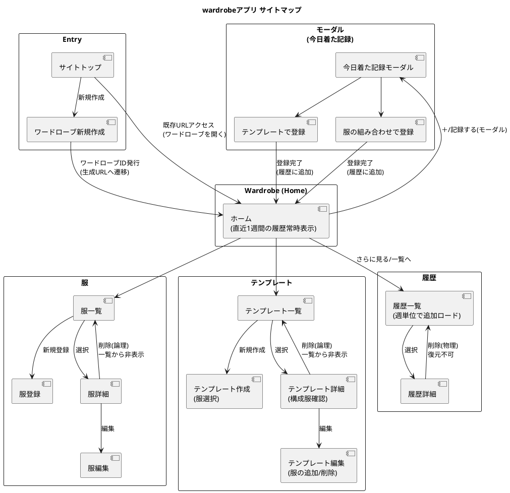

# 画面仕様書

**ワードローブ管理 Web アプリケーション（スマートフォン前提）**

---

## 1. 前提・共通仕様

### 1.1 対象デバイス

* スマートフォン（縦持ち）を前提
* タッチ操作を基本とし、**タップ領域は十分に広く取る**
* 主要操作は画面上部に配置する

---

### 1.2 ヘッダー仕様（全画面共通）

| 位置 | 要素         | 仕様                  |
| -- | ---------- | ------------------- |
| 左  | 戻るボタン      | ホーム以外の画面で表示。1画面前へ戻る |
| 中央 | ワードローブ名    | タップでホームへ遷移          |
| 右  | ハンバーガーメニュー | ドロワーメニューを表示         |

補足

* ホーム画面では戻るボタンは表示しない
* ワードローブ名が長い場合は省略表示を許容

---

### 1.3 ドロワーメニュー

* ハンバーガーメニュータップで表示
* **外タップで閉じる**
* メニュー項目（最小構成）

| 項目       |
| -------- |
| ホーム      |
| 服一覧      |
| テンプレート一覧 |
| 履歴一覧     |

---

### 1.4 一覧表示（共通）

* 表示形式：**カード表示**
* **カード全体がタップ領域**
* 画像未登録の場合は **`no image`** を表示

---

### 1.5 追加ボタン

* 一覧画面の **画面上部** に配置
* 表記例

  * `＋ 服を追加`
  * `＋ テンプレートを追加`

---

### 1.6 モーダル共通仕様

* 確認・入力は **通常モーダル表示**（フルスクリーン不可）
* モーダル外タップで閉じるかどうかは用途ごとに規定
* 閉じる操作がある場合、**入力途中なら破棄確認モーダルを表示**

---

### 1.7 確認モーダル

#### 破棄確認モーダル

* 表示条件：入力内容が変更されている状態で閉じる操作を行った場合
* 文言例

  * タイトル：入力を破棄しますか？
  * 本文：入力途中の内容は保存されません
* ボタン：

  * キャンセル
  * 破棄して閉じる

#### 削除確認モーダル

* 削除操作時に必ず表示
* 文言例

  * タイトル：削除しますか？
  * 本文：この操作は取り消せません
* ボタン：

  * キャンセル
  * 削除

---

## 2. 画面一覧

| No | 画面名        |
| -- | ---------- |
| 1  | サイトトップ     |
| 2  | ワードローブ新規作成 |
| 3  | ホーム        |
| 4  | 服一覧        |
| 5  | 服登録        |
| 6  | 服詳細        |
| 7  | 服編集        |
| 8  | テンプレート一覧   |
| 9  | テンプレート作成   |
| 10 | テンプレート詳細   |
| 11 | テンプレート編集   |
| 12 | 履歴一覧       |
| 13 | 履歴詳細       |
| 14 | 履歴編集       |
| 15 | 今日着た記録モーダル |

---

## 3. 各画面仕様

---

## 3.1 サイトトップ

### 目的

* ワードローブ新規作成への導線提供

### UI構成

* メインボタン：`ワードローブを作成`

---

## 3.2 ワードローブ新規作成

### UI構成

* 入力項目

  * ワードローブ名（必須）
* ボタン

  * 作成

### 挙動

* 作成成功後、ワードローブIDを発行しホームへ遷移
* ヘッダー中央にワードローブ名を表示

---

## 3.3 ホーム

### 目的

* 直近1週間の履歴を常時確認
* 今日着た記録の起点

### UI構成（上から下）

1. **今日着た記録ボタン**

   * 表記：`＋ 今日着た記録`
2. 直近1週間の履歴一覧（カード）
3. 履歴一覧への導線（任意）

### 履歴カード表示

* 日付＋時刻
* 入力種別
* 表示名

  * テンプレート入力：テンプレート名
  * 組み合わせ入力：服ラベルの連結表示

---

## 3.4 今日着た記録モーダル

### 共通仕様

* 通常モーダル表示
* **モーダル外タップでは閉じない**
* 登録確認画面は設けない

### 登録方法

* タブ切り替え

  * テンプレートで登録
  * 服の組み合わせで登録

#### テンプレートで登録

* テンプレートカード一覧
* 選択後、`登録` 押下で即登録

#### 服の組み合わせで登録

* 服カード一覧（複数選択）
* `登録` 押下で即登録

---

## 3.5 服一覧

### UI構成

* 上部：`＋ 服を追加`
* 服カード一覧

### カード表示

* サムネイル（画像 or `no image`）
* ラベル

---

## 3.6 服登録

### UI構成

* ラベル（必須）
* 画像（任意、1枚）
* 保存ボタン

---

## 3.7 服詳細

### UI構成

* 画像（or `no image`）
* ラベル
* 編集ボタン
* 削除ボタン（論理削除）

### 削除済み表示

* 「削除済み」オーバーレイを表示

---

## 3.8 服編集

* 服登録と同等
* 戻る操作時、変更があれば破棄確認モーダル

---

## 3.9 テンプレート一覧

### UI構成

* 上部：`＋ テンプレートを追加`
* テンプレートカード一覧

### カード表示（重要）

* テンプレート名
* 構成服サムネイル

  * **最大4件まで表示**
  * 超過分は **`+x`** 表示
  * 画像未登録は `no image`

---

## 3.10 テンプレート作成

### UI構成

* テンプレート名（必須）
* 服選択（検索付き、複数選択）
* 保存ボタン

---

## 3.11 テンプレート詳細

### UI構成

* テンプレート名
* 構成服一覧（サムネイル＋ラベル）
* 編集ボタン
* 削除ボタン（論理削除）

---

## 3.12 テンプレート編集

* テンプレート作成と同等
* 服削除時の警告なし
* 戻る時に破棄確認

---

## 3.13 履歴一覧

### UI構成

* 履歴カード一覧
* 構成服サムネイル
  * **最大4件まで表示**
  * 超過分は **`+x`** 表示
  * 画像未登録は `no image`
* 下スクロールで週単位に追加ロード

---

## 3.14 履歴詳細

### UI構成

* 日付＋時刻
* 入力種別
* 内容表示

  * テンプレート入力：テンプレート名＋**構成服一覧**
  * 組み合わせ入力：服一覧
* 削除ボタン（物理削除）

---

## 3.15 履歴編集

* 日時、入力内容の編集
* 保存
* 破棄確認モーダル

---

# 4 サイトマップ

