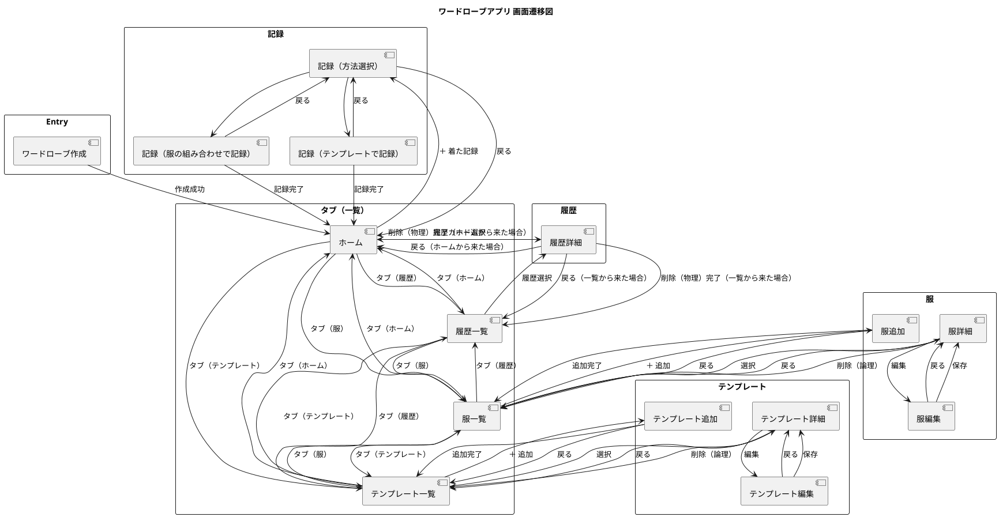

```plantuml
@startuml
title ワードローブアプリ 画面遷移図

skinparam shadowing false
skinparam packageStyle rectangle
skinparam defaultTextAlignment left

' ========================
' Entry / Wardrobe
' ========================
package "Entry" {
  [ワードローブ作成] as CreateWardrobe
}

' ========================
' Tab root screens
' ========================
package "タブ（一覧）" {
  [ホーム] as Home
  [履歴一覧] as HistoryList
  [テンプレート一覧] as TemplateList
  [服一覧] as ClothingList
}

CreateWardrobe --> Home : 作成成功

' タブ操作（相互遷移）
Home --> HistoryList : タブ（履歴）
Home --> TemplateList : タブ（テンプレート）
Home --> ClothingList : タブ（服）

HistoryList --> Home : タブ（ホーム）
HistoryList --> TemplateList : タブ（テンプレート）
HistoryList --> ClothingList : タブ（服）

TemplateList --> Home : タブ（ホーム）
TemplateList --> HistoryList : タブ（履歴）
TemplateList --> ClothingList : タブ（服）

ClothingList --> Home : タブ（ホーム）
ClothingList --> HistoryList : タブ（履歴）
ClothingList --> TemplateList : タブ（テンプレート）

' ========================
' Record
' ========================
package "記録" {
  [記録（方法選択）] as RecordMethod
  [記録（テンプレートで記録）] as RecordByTemplate
  [記録（服の組み合わせで記録）] as RecordByCombination
}

Home --> RecordMethod : ＋ 着た記録

RecordMethod --> RecordByTemplate
RecordMethod --> RecordByCombination

' 記録完了後はホームへ
RecordByTemplate --> Home : 記録完了
RecordByCombination --> Home : 記録完了

' 記録画面の戻る（すべてホームへ）
RecordMethod --> Home : 戻る
RecordByTemplate --> RecordMethod : 戻る
RecordByCombination --> RecordMethod : 戻る

' ========================
' History
' ========================
package "履歴" {
  [履歴詳細] as HistoryDetail
}

' 履歴詳細への遷移元は2通り
Home --> HistoryDetail : 履歴カード選択
HistoryList --> HistoryDetail : 履歴選択

' 履歴詳細の戻り先（文脈依存）
HistoryDetail --> Home : 戻る（ホームから来た場合）
HistoryDetail --> HistoryList : 戻る（一覧から来た場合）

' 削除は物理削除。削除後の戻り先も文脈依存
HistoryDetail --> Home : 削除（物理）完了（ホームから来た場合）
HistoryDetail --> HistoryList : 削除（物理）完了（一覧から来た場合）

' ========================
' Template
' ========================
package "テンプレート" {
  [テンプレート追加] as TemplateCreate
  [テンプレート詳細] as TemplateDetail
  [テンプレート編集] as TemplateEdit
}

TemplateList --> TemplateCreate : ＋ 追加
TemplateList --> TemplateDetail : 選択
TemplateDetail --> TemplateEdit : 編集

' 戻る操作（追加・詳細・編集はすべて持つ）
TemplateCreate --> TemplateList : 戻る
TemplateDetail --> TemplateList : 戻る
TemplateEdit --> TemplateDetail : 戻る

' 完了遷移
TemplateCreate --> TemplateList : 追加完了
TemplateEdit --> TemplateDetail : 保存

' 削除（論理）後の遷移
TemplateDetail --> TemplateList : 削除（論理）

' ========================
' Clothing
' ========================
package "服" {
  [服追加] as ClothingCreate
  [服詳細] as ClothingDetail
  [服編集] as ClothingEdit
}

ClothingList --> ClothingCreate : ＋ 追加
ClothingList --> ClothingDetail : 選択
ClothingDetail --> ClothingEdit : 編集

' 戻る操作（追加・詳細・編集はすべて持つ）
ClothingCreate --> ClothingList : 戻る
ClothingDetail --> ClothingList : 戻る
ClothingEdit --> ClothingDetail : 戻る

' 完了遷移
ClothingCreate --> ClothingList : 追加完了
ClothingEdit --> ClothingDetail : 保存

' 削除（論理）後の遷移
ClothingDetail --> ClothingList : 削除（論理）

@enduml

```